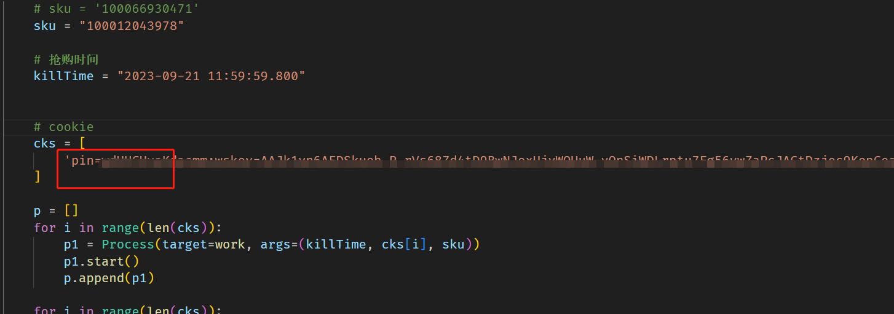
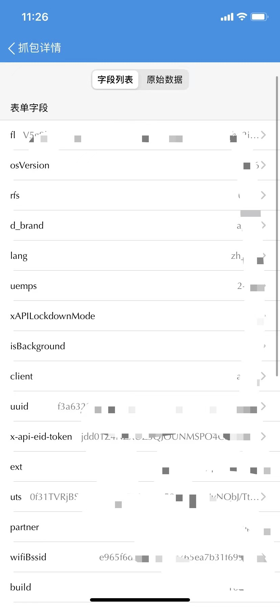

# MaoTai_GUI 可视化（即 exe 可运行文件）

JD 京东抢购、京东抢茅台 Windows 端、开箱即用无需配置环境。开发在即（开源协议采用 Apache License）

首先感谢无名作者提供部分代码思路，根据原作者部分代码，所采用 Apache License2.0 开源方式。

~~脚本软件开发调试中具体情况等待回复~~
<br/>

### **联系收款方：zcsupercn@foxmail.com**


## 更新日期
- 2023 年 10 月 6 日

  重写JD获取时间戳问题修复误差过大。
  <br/>
  

- 2023 年 9 月 27 日

  增加多线程执行

<br/>

<br/>

（前端、后端、小程序、python 等定制化开发其他软件请联系：zcsupercn@foxmail.com）

- 2023 年 9 月 20 日

### 此脚本分为两种运行模式

- Python 脚本即时运行模式

- Windows7 及以上 exe 运行模式

## 使用教程

软件使用前务必手动获取自己移动端的 Cookie。

## 第一步抓包

### Android & IOS 通用教程

此方法需要电脑和手机配合。相对来说稍微简单些，方便些，参数都在电脑上方便复制。使用**Fiddler**软件抓包

[Android 教程](https://docs.zcsuper.cn/posts/Fiddler_Android/)

[IOS 教程](https://docs.zcsuper.cn/posts/Fiddler_iPhone/)

### IOS 抓包方法 2

此外如果暂时没有电脑的情况下，可以使用软件**Stream**来进行抓包。

具体方法可参照 [IOS 抓包 2](https://blog.csdn.net/qq_39939418/article/details/124171135)

---

## 第二步解析参数

刚刚上面教程讲到移动端 Cookie 的组成是：`pin=用户名;wskey=xxxx;`

**我们把对应的 Cookie 放到软件的输入框里，或者代码文件`main.py`和`jdseckillAPIv2.py`文件里**

**以下步骤软件用户暂时忽略**

<br/>

<br/>
可放置多个 Cookie。然后把请求里面的 hades 头数据，在`Stream` 单击 选择`格式化参数`。如图
<br/>

<br/>

提取出上述参数在`jdseckillAPIv2.py`文件里`init`初始化的方法里，组成我们的提交参数

```python
 self.eid = "eidIc11281210csxxxxxxxxxs4jVhEKMSQBNx6"
 self.uuid = "f3a6322845f49axxxxx"
 self.uts = "0f31TVRjBSsqndu4/jgUPz6uymy50MQJ01UyNObxxxxxxxx"
 self.wifiBssid = "e965f6dexxxxxxx"
```

**运行**

```cmd
python myapp.py
```
