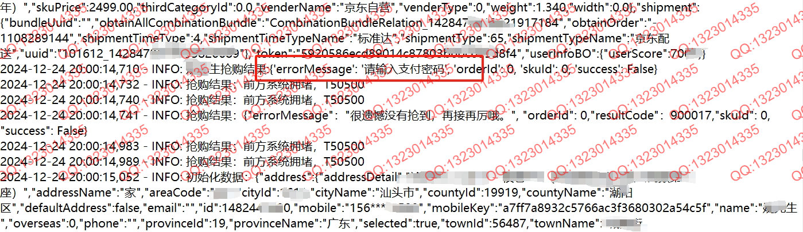
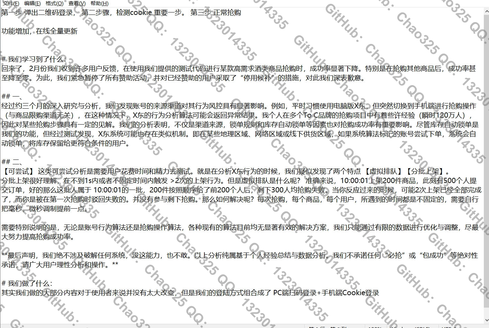
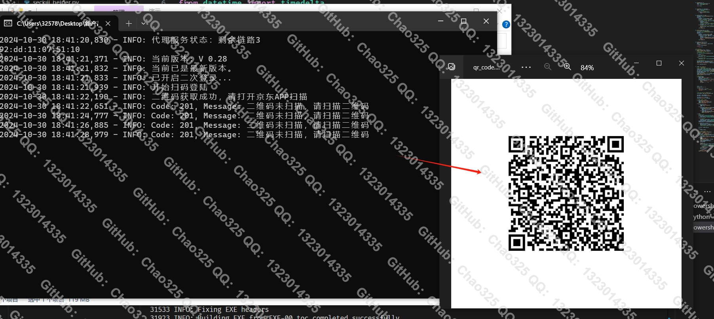
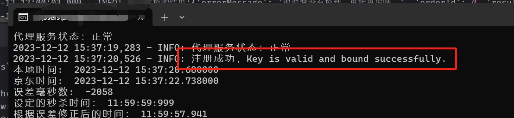
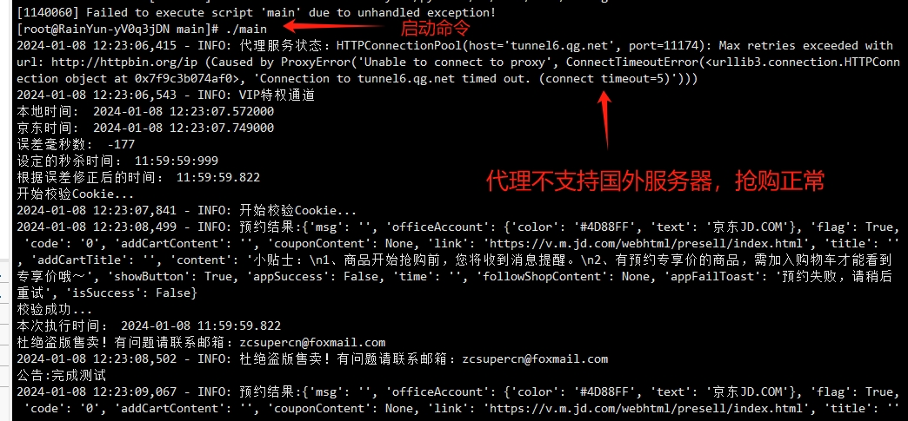
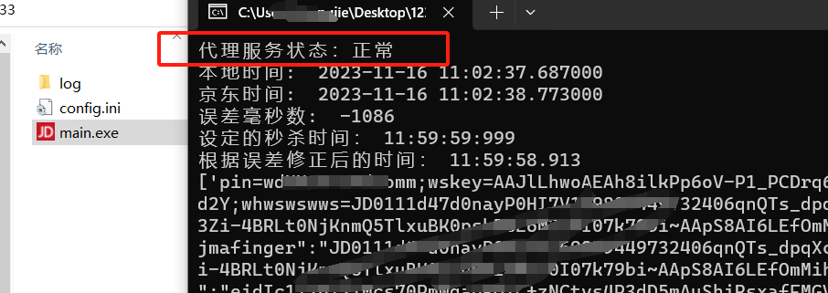
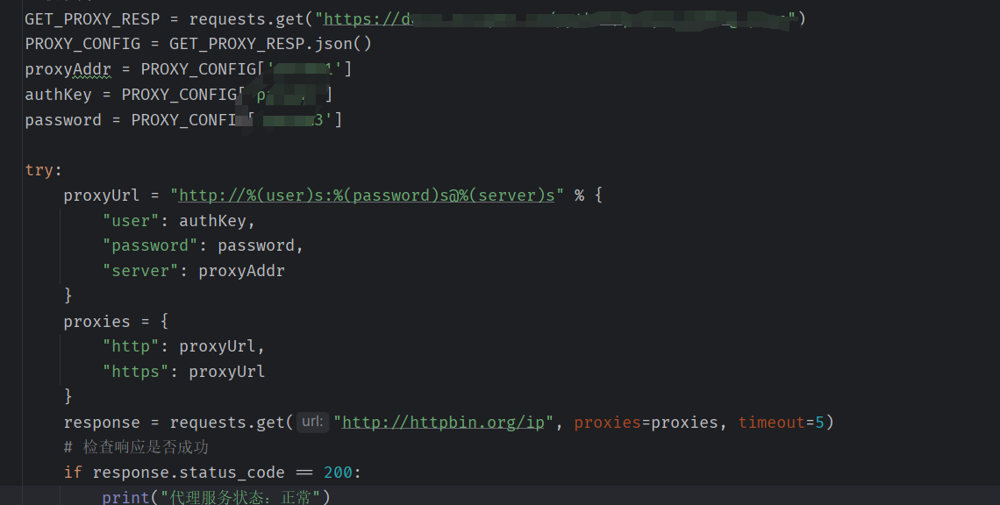
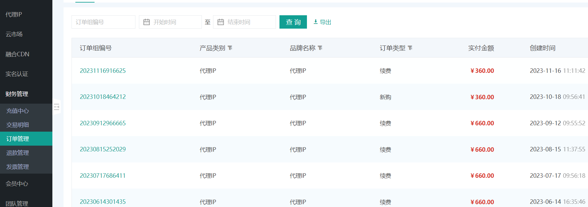
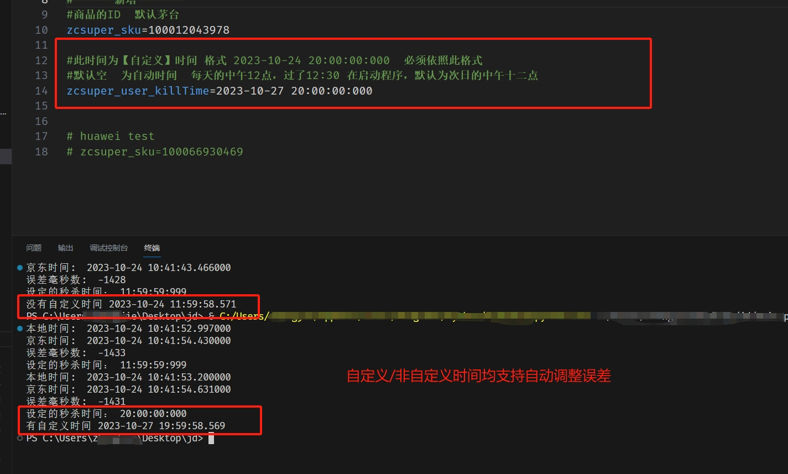

# MaoTai_GUI 可视化（即 exe 可运行文件）

JD 京东抢购、京东抢茅台 Windows 端、开箱即用无需配置环境。开发在即（开源协议采用 Apache License）
                       
首先感谢无名作者提供部分代码思路，根据原作者部分代码，所采用 Apache License2.0 开源方式。     
               
~~脚本软件开发调试中具体情况等待回复~~        
<br/>       
                                  
# 免责声明  
感谢您使用本程序的开源代码/程序。在下载和使用此代码/程序之前，请仔细阅读并理解以下声明。           
    
1. 保护知识产权：本程序的开源代码受版权法和相关法律的保护。作者享有其代码的所有权利，包括但不限于著作权、专利权和商标权。未经作者许可，禁止以任何形式侵犯这些权益。       
2. 学习交流目的：本程序的开源代码仅供学习和交流使用。下载者应将其用途限定在个人研究、学习或非商业项目中。严禁将本代码用于任何违法、侵权、破坏性或其他有害行为。
3. 法律合规性：下载者应遵守所在地的法律法规，并承担使用本代码所产生的一切法律责任。对于因使用本代码引起的任何损失或法律纠纷，作者概不负责。
4. 删除义务：下载者同意，在下载、使用或停止使用本程序的开源代码后，应在24小时内彻底删除该代码/程序及其衍生物。此举旨在保护作者的知识产权和隐私。
5.  免责声明的限制：本免责声明不排除或限制适用于法律规定的任何责任。在适用法律允许的最大范围内，作者不对使用本程序代码所导致的任何直接或间接损害承担责任
    
请务必仔细阅读并理解以上声明。下载、使用本程序的开源代码或软件即表示您同意遵守上述规定并承担相应的法律责任。
        
## 停止捐赠

**谢谢各位朋友对开发者的支持，捐赠数额足以弥补开发上所支出的费用，所以此脚本停止捐赠。**

**如果有朋友想要学习或了解此脚本的抢购逻辑，及代码详情（代码趋于稳定）可以联系邮箱：zcsupercn@foxmail.com**

  ## 通知：
  ### 8月27日下午六时左右，通过用户反馈后查明因某东异常调整，导致所有代理服务器全部失效，正在紧急调整，预计三天内修复，如超出期限将获得N+1天卡的补偿，非常抱歉！！
  8月28下午14时已修复，请打开软件更新

## 更新日志【Windows】：
### 2025年8月21日　
（日期有误已更改，原：7.9）
版本范围：Windows，无Linux。
- 修改证书握手流程，提高HTTPS连接速度
- 修改操作日志审计功能，所有关键操作皆有迹可循
- 动刷新的登录状态监测机制，有效规避因会话过期导致的功能失效


### 部分用户提示密码错误
<br/>


## 这段时间：
<br/>


----------------END-----------------

### 2024年10月30日
- 增加了二次登录
- 增加若干逻辑

### 二次登录
<br/>



<br/>



## 看教程/捐赠前你需要知道的几件事
 - 觉得软件一定能够抢到的用户，建议直接原价买茅X。


## 使用教程

**<a href='https://docs.qq.com/doc/DUXBaSmZta1dJVm5Z'>【新版本】软件用户教程</a> （作废）**

**<a href='https://docs.qq.com/doc/DR01CQnFjWkVEUnZ0'>【旧版】软件用户教程</a>**

**<a href='https://docs.qq.com/doc/DR0VWbUl0cVVva3hG'>【必看】如何查看我抢购成功或失败？</a>**


**<a href='https://docs.qq.com/doc/DR2ZGVmphcHREQkJw'>安卓手机如何抓包</a>**


**<a href='https://docs.qq.com/doc/DR2d5ZHdtRG9hRFRl'>苹果手机如何抓包</a>**

**关于获取JD的 area 地址参数 请看教程说明（感谢tychxn提供帮助）**


# 警惕骗子1

**骗子拿着免费软件骗人Gitee:https://gitee.com/yanbiubiu/iqmaotai?_from=gitee_search**


## **<a href='https://docs.qq.com/doc/DR3dnamJaeVpYRHlG'>点我查看骗子详细信息</a>**

- 骗子QQ：2524267174
  
**骗子仓库地址为 ：https://github.com/wbzzzz/maotai_seckill**


- 骗子QQ：2335625964
- 骗子QQ：2972306946
- 骗子微信：yc2335625964

**骗子第一个仓库地址为：https://github.com/huawei-hw/JD-2023-10-8**

**骗子第二个仓库地址为：https://github.com/BigC5201314/jd**


# 警惕骗子2
## 很久不更新维护的破软件卖4000 。
## 骗子微信号：nkCnCn1991
<br/>

<br/>


## 更新日志：
### 2025年7月9日

- 新增自动监测登录状态机制，避免长时间挂机导致登录失效（重要）
- 优化服务器响应容错机制，异常状态下自动尝试重连3次
- 提高模拟下单成功率，调整请求路径与加密参数逻辑
- 补充品牌机型库，覆盖更多商品场景（特别是618后的新增机型）
- 修复部分用户反馈的任务计划执行不准问题（定时任务偏差±3s内）

### 2025年06月15日
- 增加3种品牌机型全数据模拟（用户未提供有效数据情况下使用）
- 修复高并发下CPU占用过高的问题
- 模拟指纹数据量从50组提升至200组
- 网络请求间隔随机化算法升级
### 2025年2月14日
-  某东服务器时间异常导致软件无法运行
- 修改了支付密码逻辑 

### 2025年1月5日
- 修改了支付锁单逻辑
- 修改了支付密码逻辑 

### 2024年03月21日
- 因费用问题，调整了IP分配逻辑，频繁使用，IP固定分配。使用较少，IP随机分配或者暂不分配（不分配照常使用）。
- 添加验证码自动验证。
- 修改提交参数，可调商品数量
- **新增账号刷新功能（经测试有概率增加某东分）（重要）**
- 删除部分逻辑。

### 2024年02月05日
- 更换了IP代理商线程更多，IP池更丰富。
- **重新更改了部分参数，大大降低账号被盾以及网络原因导致的没参与抢购（重要）**


### 2024年1月18日（服务器小白请忽略）
- 小白请忽略！暂无教程，后续会出。
- 小白请忽略！暂无教程，后续会出。
- 国外服务器暂时不可使用代理，抢购正常
- 新增服务器版本，可用于cron定时任务，每天定时启动，撇去手动烦恼。
## 简单的使用方法
解压main文件夹后，进入到main文件内，输入命令`./main` ：
```
[root@RainYun-yV0q3jDN main]# ./main
```

<br/>



### 2023年12月4日（程序版）
- 1号（十二点后）~4号（十二点前）号维护，停止抢购
  

<br/>

<br/>

<br/>


### 2023年11月23日（程序版）
- 新增部分逻辑代码在线更新功能，X东修改规则能够及时更新无需频繁下载软件。
- 修复，调整部分代理环境出错问题。

此版本按需自取。
### 2023年11月16日（程序版）
- 修复了频繁预约防止账号抢购时被盾（黑号无解）
- **新增了抢购代理IP功能（看下面说明）**
- 处理解决了其他问题等优化功能

**说明：代理IP是自费购买，一个月360～700元不等所以部分代码不公开，其次代理通道范围为5~10，所以没有多账号抢购的需求用户，幸苦把额度留给有需要的人。因为个人能力有限，代理暂时不支持自定义以及增加通道需求。**

### 2023年10月24日
**此版本逻辑没变，之前赞助的人，请按需自取。**

- 新增启动时Cookie校验
- 提前半小时自动预约
- 新增可配置项
  - 配置商品ID （除茅台外不保证任何其他商品）
  - 自定义时间配置
  - **自定义时间也支持自动调节误差值啦！**

关于自定义时间，也是好多用户操作不方便才改动的。

目前是 **自动时间** 和 **自定义时间两种**，自动时间就是启动脚本的时候默认抢购时间为当天的12点，超过当天12点半启动软件默认为次日12点。

但是鉴于JD对双十一放量活动，索性直接把自定义时间拿到外面支持修改（默认为空）


<br/>

### 2023年10月13日
- 周末前临时改个问题。
- **修复了JD中文用户名无法登录，无法预约抢购报错{'login':-1} 问题**


### 2023年10月13日（12日晚）
 - 紧急修复！！！请所有捐赠者找我要代码！！！
  - 修复了抢购时候出现的登陆失败{login：-1}
  - 修复地址错误
  - 更改Sign算法
  - 提前30分钟自动预约

### 2023年10月11日
- Cookie一键配置（取消多文件来回修改）
- 其他参数简化配置 （小白也可配置）
- 压缩包增加了Windows的python环境安装包，便携安装
<br/>

  

### 2023年10月8日
- 再次修复了JD服务器时间戳错误不准确问题
- （这次是实打实JD服务器返回时间）
<br/>


### 2023年10月6日

- 修复了JD获取时间戳的问题，以前可能存在误差过大的情况。
<br/>


### 2023年9月27日

- 增加了多线程执行功能，这将提高程序的执行效率和性能。


（前端、后端、小程序、python 等定制化开发其他软件请联系：zcsupercn@foxmail.com）

- 2023 年 9 月 20 日


  ## 其他说明
  ### 2023年10月13号说明：
- 不建群，软件下午免费开放。已经很久不维护了。代码才是最新的。

- 华为抢购图：

  
  

### 此脚本分为两种运行模式

- Python 脚本即时运行模式

- Windows7 及以上 exe 运行模式


