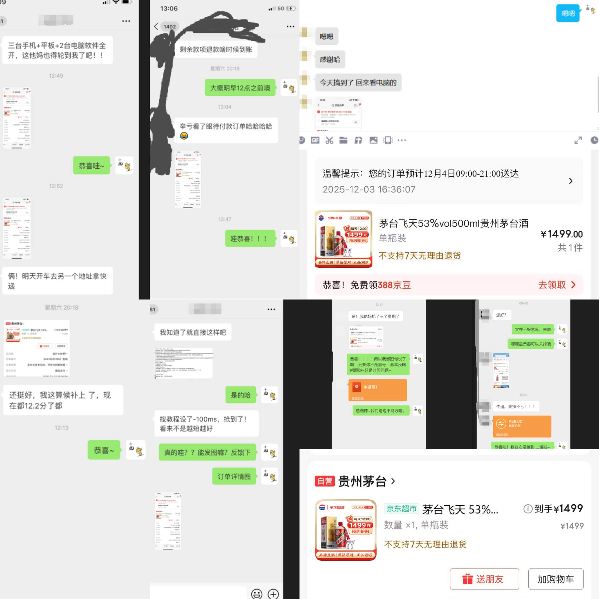

# MaoTai_GUI 可视化（即 exe 可运行文件）

JD 京东抢购、京东抢茅台 Windows 端、开箱即用无需配置环境。开发在即（开源协议采用 Apache License）
                                     
首先感谢无名作者提供部分代码思路，根据原作者部分代码，所采用 Apache License2.0 开源方式。     

               
~~脚本软件开发调试中具体情况等待回复~~        
<br/>

# 免责声明  
感谢您使用本程序的开源代码/程序。在下载和使用此代码/程序之前，请仔细阅读并理解以下声明。           
    
1. 保护知识产权：本程序的开源代码受版权法和相关法律的保护。作者享有其代码的所有权利，包括但不限于著作权、专利权和商标权。未经作者许可，禁止以任何形式侵犯这些权益。       
2. 学习交流目的：本程序的开源代码仅供学习和交流使用。下载者应将其用途限定在个人研究、学习或非商业项目中。严禁将本代码用于任何违法、侵权、破坏性或其他有害行为。
3. 法律合规性：下载者应遵守所在地的法律法规，并承担使用本代码所产生的一切法律责任。对于因使用本代码引起的任何损失或法律纠纷，作者概不负责。
4. 删除义务：下载者同意，在下载、使用或停止使用本程序的开源代码后，应在24小时内彻底删除该代码/程序及其衍生物。此举旨在保护作者的知识产权和隐私。
5.  免责声明的限制：本免责声明不排除或限制适用于法律规定的任何责任。在适用法律允许的最大范围内，作者不对使用本程序代码所导致的任何直接或间接损害承担责任
    
请务必仔细阅读并理解以上声明。下载、使用本程序的开源代码或软件即表示您同意遵守上述规定并承担相应的法律责任。
        
## 停止捐赠
                      
**谢谢各位朋友对开发者的支持，捐赠数额足以弥补开发上所支出的费用，所以此脚本停止捐赠。**

**如果有朋友想要学习或了解此脚本的抢购逻辑，及代码详情（代码趋于稳定）可以联系邮箱：zcsupercn@foxmail.com**


# 更新日志【Windows & Linux】

## 2025年12月12日（24:57）

### 版本范围
- Windows
- Linux

---
### 临时收集的一些反馈图

<br/>


## 先说两个重点改动
**1、软件必要内容全面接入AI（DeepSeek（国内最快最稳最便宜））**
  - 包括但不限于 线程安全问题 性能问题 CPU占用过高 线程重复重启，时间重复重新计算等
**2、软件大幅度重写，本来软件体积高达100MB 现在10MB以内。**


## 一、针对“虚拟排队”问题的优化

### 时序算法升级

#### 新版时序控制逻辑

```
检测到上架信号 → 延迟触发(个性化设置) → 首次尝试
    ↓
如果失败 → 立即准备第二次尝试(等待分批上架)
    ↓
设置随机延迟(1-50ms) → 再次尝试
    ↓
记录每次尝试时间戳 → 用于后续算法优化
```

### 区域化库存策略优化

#### 库存分配模式
```
北京仓库：100件 → 华北地区用户优先
上海仓库：80件 → 华东地区用户优先
广州仓库：70件 → 华南地区用户优先
```

#### 订单验证机制
当用户尝试下单时，平台会执行：

1. **区域匹配验证**
   - 根据账号的收货地址历史匹配区域
   - 结合实时IP地址进行二次验证
   - 如果区域不匹配，即使库存充足也可能被标记为“异常订单”

---

## 二、登录系统优化

### PC端扫码登录的优势
-  **继承PC端设备指纹和浏览器环境**
-  **维持账号在PC端的正常使用画像**
-  **避免突然切换到移动端的行为异常**

### 手机端Cookie登录的补充
-  **在必要时可以快速切换到手机端操作**
-  **保持账号活跃度的双向验证**
-  **为特殊抢购场景提供备用通道**

---

## 三、新增功能
### 智能地址匹配系统

#### 功能特性
- **自动区域优化**
  - 根据账号历史地址自动选择最优仓库区域
  - 在抢购前临时调整收货地址（如有多地址可用）
  - 记录不同地址的成功率数据，形成个性化策略

#### 数据记录
- 区域匹配成功率统计
- 地址切换时间点记录
- 各仓库响应速度对比

---

## 四、重要提醒

### 5.1 账号健康管理

#### 用户操作建议
1. **保持行为一致性**
   - 尽量在固定设备和网络环境下使用账号

2. **合理分散操作**
   - 不要在同一账号上连续进行高频抢购

3. **维护正常使用记录**
   - 定期进行浏览、比价、加购物车等正常操作

### 5.2 预期管理

#### 成功率说明
- **理论最高成功率**：任何工具的理论最高成功率不会超过50%

#### 关键因素排序
1. **账号质量**（50%）
   - 账号历史行为记录
   - 账号等级与信誉度
   - 消费记录完整性

2. **网络环境**（30%）
   - 网络延迟与稳定性
   - IP地址质量
   - 设备连接状态

3. **工具优化**（20%）
   - 算法精准度
   - 响应速度
   - 策略适应性

#### 风险提示
 **平台算法仍在不断升级**，今天有效的方法明天可能失效

---

## 五、使用建议

### 最佳实践
1. **多账号轮换使用**
2. **保持正常的购物行为**
3. **定期清理浏览器缓存**
4. **避免在同一时间段频繁操作**

### 故障排除
- 如遇连续失败，建议暂停24小时
- 检查网络环境稳定性
- 验证账号是否存在异常限制

---

## 版本信息
- **更新日期**：2025年12月12日
- **适用平台**：Windows、Linux
- **更新类型**：功能优化与策略调整
- **影响范围**：所有用户

---

**备注**：本次更新主要针对平台算法变化进行适应性调整，建议所有用户更新至最新版本以获得最佳体验。

---
*文档版本：v2.1.0 | 最后更新：2025-12-12*


### 部分用户提示密码错误
<br/>


## 这段时间：
<br/>


----------------END-----------------

### 2024年10月30日
- 增加了二次登录
- 增加若干逻辑

### 二次登录
<br/>


<br/>


## 看教程/捐赠前你需要知道的几件事
 - 觉得软件一定能够抢到的用户，建议直接原价买茅X。


## 使用教程

**<a href='https://docs.qq.com/doc/DUXBaSmZta1dJVm5Z'>【新版本】软件用户教程</a> （作废）**

**<a href='https://docs.qq.com/doc/DR01CQnFjWkVEUnZ0'>【旧版】软件用户教程</a>**

**<a href='https://docs.qq.com/doc/DR0VWbUl0cVVva3hG'>【必看】如何查看我抢购成功或失败？</a>**


**<a href='https://docs.qq.com/doc/DR2ZGVmphcHREQkJw'>安卓手机如何抓包</a>**


**<a href='https://docs.qq.com/doc/DR2d5ZHdtRG9hRFRl'>苹果手机如何抓包</a>**

**关于获取JD的 area 地址参数 请看教程说明（感谢tychxn提供帮助）**


# 警惕骗子1

**骗子拿着免费软件骗人Gitee:https://gitee.com/yanbiubiu/iqmaotai?_from=gitee_search**


## **<a href='https://docs.qq.com/doc/DR3dnamJaeVpYRHlG'>点我查看骗子详细信息</a>**

- 骗子QQ：2524267174
  
**骗子仓库地址为 ：https://github.com/wbzzzz/maotai_seckill**


- 骗子QQ：2335625964
- 骗子QQ：2972306946
- 骗子微信：yc2335625964

**骗子第一个仓库地址为：https://github.com/huawei-hw/JD-2023-10-8**

**骗子第二个仓库地址为：https://github.com/BigC5201314/jd**


# 警惕骗子2
## 很久不更新维护的破软件卖4000 。
## 骗子微信号：nkCnCn1991
<br/>

<br/>


## 历史更新日志：
--版本过多暂时不更新

### 此脚本分为两种运行模式

- Python 脚本即时运行模式

- Windows7 及以上 exe 运行模式


