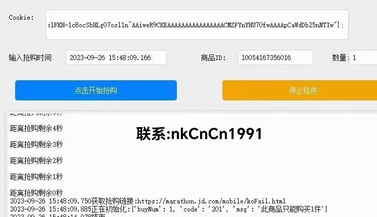
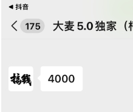

# MaoTai_GUI 可视化（即 exe 可运行文件）

JD 某某东抢购、某某东抢茅台 Windows 端、开箱即用无需配置环境。开发在即（开源协议采用 Apache License）
                                     
首先感谢无名作者提供部分代码思路，根据原作者部分代码，所采用 Apache License2.0 开源方式。
~~脚本软件开发调试中具体情况等待回复~~                        

1
          
# 免责声明  
感谢您使用本程序的开源代码/程序。在下载和使用此代码/程序之前，请仔细阅读并理解以下声明。                    
       
1. 保护知识产权：本程序的开源代码受版权法和相关法律的保护。作者享有其代码的所有权利，包括但不限于著作权、专利权和商标权。未经作者许可，禁止以任何形式侵犯这些权益。       
2. 学习交流目的：本程序的开源代码仅供学习和交流使用。下载者应将其用途限定在个人研究、学习或非商业项目中。严禁将本代码用于任何违法、侵权、破坏性或其他有害行为。
3. 法律合规性：下载者应遵守所在地的法律法规，并承担使用本代码所产生的一切法律责任。对于因使用本代码引起的任何损失或法律纠纷，作者概不负责。
4. 删除义务：下载者同意，在下载、使用或停止使用本程序的开源代码后，应在24小时内彻底删除该代码/程序及其衍生物。此举旨在保护作者的知识产权和隐私。
5.  免责声明的限制：本免责声明不排除或限制适用于法律规定的任何责任。在适用法律允许的最大范围内，作者不对使用本程序代码所导致的任何直接或间接损害承担责任
    
请务必仔细阅读并理解以上声明。下载、使用本程序的开源代码或软件即表示您同意遵守上述规定并承担相应的法律责任。
        
## 停止捐赠              
                      
**谢谢各位朋友对开发者的支持，捐赠数额足以弥补开发上所支出的费用，所以此脚本停止捐赠。**

**如果有朋友想要学习或了解此脚本的抢购逻辑，及代码详情（代码趋于稳定）可以联系邮箱：zcsupercn@foxmail.com**


某东商品预约与抢购工具，支持 Python 源码运行及 Windows 单文件 EXE 构建。

> 当前版本：V1.33
>
> 最后更新：2026-07-28
>
> 当前形态：Windows 控制台程序

本项目参考了早期开源实现的部分代码思路，并在此基础上持续修复登录、时间同步、网络请求和多线程协作问题。

## 当前功能

| 平台 | 登录 | 后续流程 | 当前状态 |
| --- | --- | --- | --- |
| 某某宝淘宝 | 二维码图片、短信验证、独立浏览器兜底 |商品校验、预约及抢购 | 已接入 |
| 某某东 | 本地 Cookie 复用、在线校验、二维码重新登录 | 某某东商品校验、预约及抢购 | 已接入 |
| 大麦 | 二维码图片、短信验证、独立浏览器兜底 | 暂不执行抢票 | 登录已接入，抢票开发中 |

其他已实现能力：

- 某某宝淘宝、某某东、大麦 Cookie 分平台保存，过期或服务端失效后自动重新登录。
- Cookie 文件采用临时文件替换，降低程序中断造成文件损坏的风险。
- 某某宝淘宝和大麦二维码保存为本地图片，无需在无头浏览器窗口中扫码。
- 遇到短信或安全验证时，优先在命令行完成；控件不可用时打开专用浏览器窗口。
- 某某东服务器时间差只修正一次。
- 多个抢购线程共享成功状态，一个线程成功后其他线程停止继续提交。
- 外部请求设置超时并启用 TLS 证书校验。

## 运行环境

- Windows 10/11
- Python 3.11（源码运行）
- Chrome 或 Microsoft Edge（某某宝淘宝、大麦扫码登录及安全验证）

Linux 尚未完成当前版本的真实登录和打包验证，不作为本版正式支持环境。

## 运行


启动前请根据自己的合法账号和使用场景配置 `config.ini`。主要配置项包括：

- `exeUser_key`：当前程序使用的授权信息。
- `exeUser_sku`：某某东商品 SKU。
- `exeUser_user_killTime`：可选的自定义抢购时间，格式为 `YYYY-MM-DD HH:MM:SS:mmm`。
- `exeUser_Cookie`：仅用于兼容旧版本；成功登录后统一使用本地 Cookie 存储。

登录超时配置位于 `configWeb.ini`：

```ini
[taobao]
login_timeout = 180

[damai]
login_timeout = 180
```

## 使用流程

程序会先执行公告、版本、维护状态及授权校验，然后显示平台菜单：

```text
请选择登录平台：
1. 某某宝淘宝
2. 某某东
3. 大麦
请输入 1、2 或 3：
```

### 选择某某宝淘宝

完成真实某某宝淘宝登录后，程序会继续取得有效的某某东登录状态，再进入现有某某东商品预约和抢购流程。某某宝淘宝 Cookie 不会被传入某某东接口。

### 选择某某东

程序优先复用 `cookies/jd.json`，登录状态失效时重新生成某某东二维码。认证成功后进入某某东预约和抢购流程。

### 选择大麦

程序优先复用 `cookies/damai.json`，失效时重新扫码。登录成功后显示真实用户名和“大麦抢票功能正在开发中”，不会调用某某东接口，也不会模拟大麦抢票结果。

## Cookie 与隐私

登录状态默认保存在：

```text
cookies/jd.json
cookies/taobao.json
cookies/damai.json
```

请勿在日志、Issue、聊天记录或提交中公开 Cookie、短信验证码、卡密、设备标识和抓包数据。

如果仓库副本曾包含真实凭据，仅删除文件并不能使凭据失效；请同时在对应平台执行退出登录、修改密码或凭据轮换。


## 当前限制

- 工具不能保证购买成功，结果仍受库存、账号状态、网络和平台规则影响。
- 大麦目前只完成真实登录和 Cookie 管理，尚未接入商品查询、选场次、选票档或下单。
- 平台接口和风控页面可能随时变化，二维码或短信验证流程可能需要后续适配。

## 更新日志

### V1.33（2026-07-28）

- 新增统一平台菜单：某某宝淘宝、某某东、大麦。
- 新增某某宝淘宝和大麦真实二维码图片登录、短信二次验证及浏览器兜底。
- 新增三平台 Cookie 独立存储、过期检查和在线登录态校验。
- 某某宝淘宝登录后衔接有效某某东会话；大麦登录成功后明确提示抢票开发中。
- 修复服务器时间差重复应用、签名分支结果被覆盖等问题。
- 移除导入模块时的外部请求，补充请求超时和 TLS 校验。
- 抢购线程共享停止事件，成功后阻止其他线程继续提交。

### 2024-10-30

- 增加二次登录相关逻辑。


## 使用教程

**<a href='https://docs.qq.com/doc/DUXBaSmZta1dJVm5Z'>【新版本】软件用户教程</a> （作废）**

**<a href='https://docs.qq.com/doc/DR01CQnFjWkVEUnZ0'>【旧版】软件用户教程</a>**

**<a href='https://docs.qq.com/doc/DR0VWbUl0cVVva3hG'>【必看】如何查看我抢购成功或失败？</a>**


**<a href='https://docs.qq.com/doc/DR2ZGVmphcHREQkJw'>安卓手机如何抓包</a>**


**<a href='https://docs.qq.com/doc/DR2d5ZHdtRG9hRFRl'>苹果手机如何抓包</a>**

**关于获取JD的 area 地址参数 请看教程说明（感谢tychxn提供帮助）**


# 警惕骗子1

**骗子拿着免费软件骗人Gitee:https://gitee.com/yanbiubiu/iqmaotai?_from=gitee_search**


## **<a href='https://docs.qq.com/doc/DR3dnamJaeVpYRHlG'>点我查看骗子详细信息</a>**

- 骗子QQ：2524267174
  
**骗子仓库地址为 ：https://github.com/wbzzzz/maotai_seckill**


- 骗子QQ：2335625964
- 骗子QQ：2972306946
- 骗子微信：yc2335625964

**骗子第一个仓库地址为：https://github.com/huawei-hw/JD-2023-10-8**

**骗子第二个仓库地址为：https://github.com/BigC5201314/jd**


# 警惕骗子2
## 很久不更新维护的软件卖4000 。
## 骗子微信号：nkCnCn1991
<br/>

<br/>


